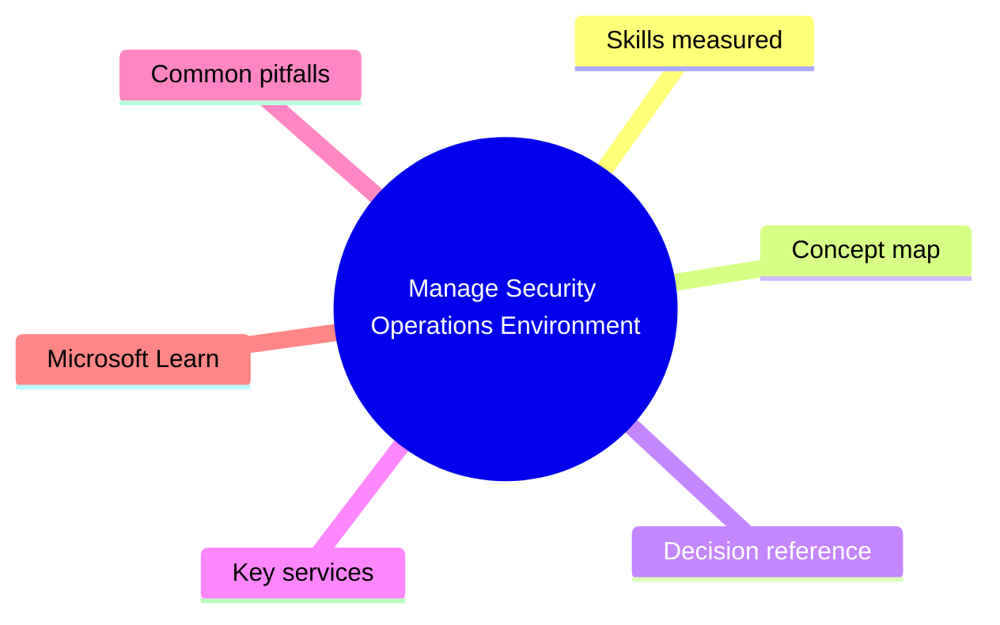
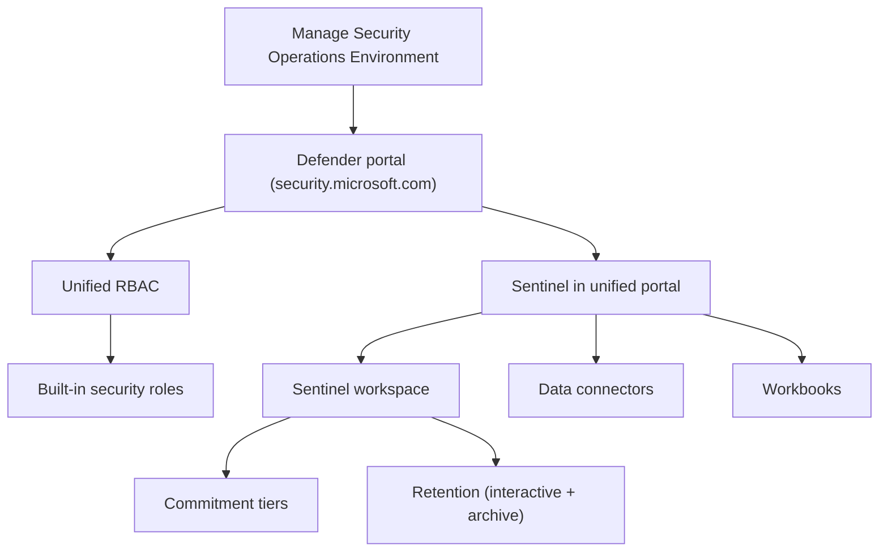

# Manage Security Operations Environment

> Domain 1 of SC-200. Weight: 25%.

## Domain mind map

## Skills measured

- Configure settings in Microsoft Defender XDR portal (security.microsoft.com)
- Manage role-based access control (RBAC), Unified RBAC, and assigned roles
- Configure data retention, alert tuning, and notification preferences
- Connect Defender XDR to Microsoft Sentinel (unified portal)
- Manage settings for the Microsoft Sentinel workspace (workspace, retention, commitment tier)

## Concept map

## Decision reference

| When you see... | Pick... | Why |
|---|---|---|
| Need to grant SOC analyst access without Global Admin | Defender XDR Security Reader / Operator via Unified RBAC | Least-privilege per workload |
| Reduce noise from a noisy detection rule | Tune the analytics rule (entity mapping, threshold) or alert-suppression rules | Avoid disabling outright |
| Optimize Sentinel ingestion cost | Move chatty tables to Basic Logs / Auxiliary + commit to a tier | Big savings if predictable volume |
| Long-term retention for compliance | Sentinel archive tier (up to 12 years) | Cheaper than interactive retention |
| Same incident in Defender + Sentinel | Connect Defender XDR connector + sync incidents | Single incident in unified portal |

## Key services

- **Microsoft Defender portal** - Unified SecOps UI now hosting Sentinel
- **Unified RBAC** - Cross-workload roles (XDR + Sentinel)
- **Sentinel workspace** - Log Analytics workspace + Sentinel solution
- **Commitment tiers** - 100GB/200GB/.../5TB/day prepay tiers
- **Defender XDR connector for Sentinel** - Bi-directional incident sync

## Common pitfalls

- Granting Global Admin instead of using Unified RBAC roles
- Forgetting that long-term retention (>90 days for some tables) is billable separately
- Connecting Defender XDR to Sentinel twice (legacy connectors leak duplicate incidents)
- Mis-scoping a workspace (one per region per business unit usually beats single global)

## Microsoft Learn

- [Configure your Microsoft Sentinel environment](https://learn.microsoft.com/training/paths/configure-your-microsoft-sentinel-environment/)
- [Microsoft Defender XDR Unified RBAC](https://learn.microsoft.com/defender-xdr/manage-rbac)

---

[<- Master Index](00-MASTER-INDEX.md) | [Master Index](00-MASTER-INDEX.md) | [Configure Protections and Detections ->](02-protections-detections.md)
