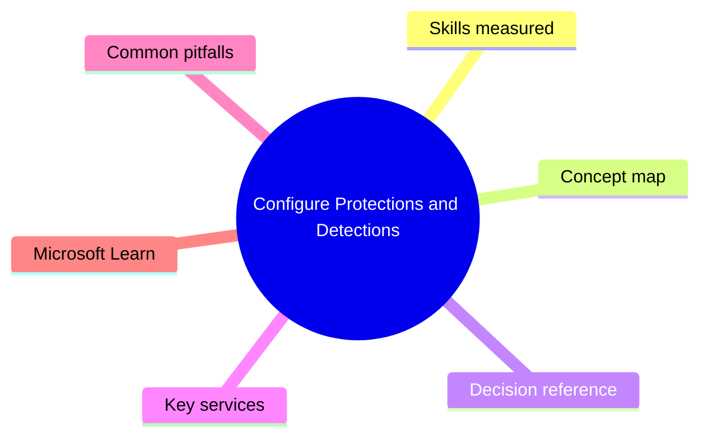
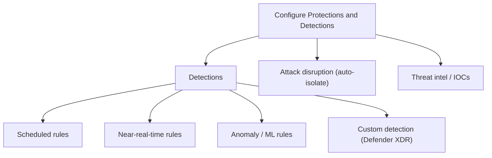

# Configure Protections and Detections

> Domain 2 of SC-200. Weight: 20%.

## Domain mind map

## Skills measured

- Configure protections in Defender XDR workloads (DfE, DfO, DfI, DfCA)
- Configure detections in Sentinel: scheduled / NRT / ML / Microsoft analytics rules
- Configure attack-disruption settings
- Tune false positives, manage suppression, configure indicators of compromise (IOCs)
- Configure custom detection rules in Defender XDR

## Concept map

## Decision reference

| When you see... | Pick... | Why |
|---|---|---|
| Need detection within seconds | Near-real-time (NRT) rule (1-min cadence) | Sched rules can be 5+ min latency |
| Detection on cross-workload data (sign-ins + emails) | Custom detection in Defender XDR using advanced hunting KQL | Cross-table queries |
| Block C2 IP across estate | Add IOC in Defender XDR -> indicators | Pushed to MDE/Office 365 |
| Reduce false positives without losing detection | Add suppression rule scoped to specific entity | Keeps rule live |
| Auto-isolate compromised host | Enable Attack Disruption + automated investigation full remediation | Built-in in Defender XDR |

## Key services

- **Sentinel analytics rules** - Scheduled, NRT, ML, MS Security, Fusion
- **Defender XDR custom detection** - KQL on AdvancedHunting tables
- **Threat intelligence (IOCs)** - Indicators in DfE / DfO / Sentinel TI
- **Attack disruption** - Automated containment in Defender XDR

## Common pitfalls

- Confusing Sentinel analytics rules with Defender XDR custom detections (two engines)
- Disabling noisy rules instead of tuning entities/suppression
- Forgetting Fusion is enabled by default and produces high-fidelity multi-stage incidents
- Adding too many IOCs without aging them out

## Microsoft Learn

- [Create detections in Microsoft Sentinel](https://learn.microsoft.com/training/paths/create-manage-security-alerts/)
- [Defender XDR custom detection rules](https://learn.microsoft.com/defender-xdr/custom-detections-overview)

---

[<- Manage Security Operations Environment](01-secops-environment.md) | [Master Index](00-MASTER-INDEX.md) | [Manage Incident Response ->](03-incident-response.md)
