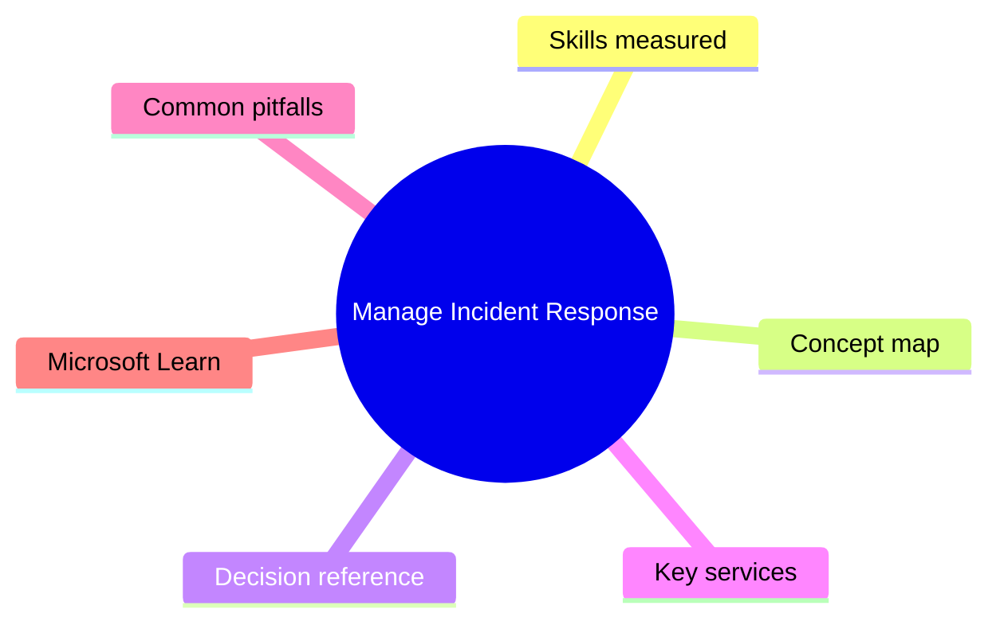
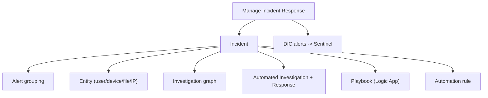

# Manage Incident Response

> Domain 3 of SC-200. Weight: 35%.

## Domain mind map

## Skills measured

- Investigate and respond to incidents in Defender XDR + Sentinel
- Investigate and respond to alerts in Defender for Endpoint, Office 365, Identity, Cloud Apps, Cloud
- Manage automated investigation and response (AIR) settings
- Author SOAR playbooks (Logic Apps) and automation rules
- Configure Microsoft Defender for Cloud incidents and entity recommendations

## Concept map

## Decision reference

| When you see... | Pick... | Why |
|---|---|---|
| Auto-disable compromised user | AIR + automation rule running 'Disable user' playbook | Hands-off response |
| Triage 50 incidents/day | Group incidents by entities + tag + automate low-severity | Automation rules to assign + close |
| Rich investigation graph for an attack | Defender XDR -> Incidents -> Attack Story | Native MS view |
| Investigate cross-tool incident | Open in unified Defender portal (XDR + Sentinel merged) | Single incident |
| Custom enrichment (whois, geoIP) | Logic App playbook with API calls + comment back | Standard SOAR pattern |

## Key services

- **Defender XDR incident queue** - Cross-workload incident with attack story
- **Sentinel incidents** - Multi-source aggregated; now in same Defender portal
- **Automation rules** - Conditional triggers in Sentinel
- **Playbooks** - Logic Apps with the Sentinel/XDR connectors
- **AIR** - Native auto-investigation in DfE/DfO

## Common pitfalls

- Creating duplicate playbooks - prefer Sentinel-managed playbooks for clean RBAC
- Auto-closing incidents without notifying SOC lead
- Ignoring incident comments / activity log (audit trail for compliance)
- Misconfiguring AIR to 'No automated response' on critical workloads

## Microsoft Learn

- [Mitigate threats using Microsoft Defender XDR](https://learn.microsoft.com/training/paths/sc-200-mitigate-threats-using-microsoft-365-defender/)
- [Sentinel automation](https://learn.microsoft.com/azure/sentinel/automation/)

---

[<- Configure Protections and Detections](02-protections-detections.md) | [Master Index](00-MASTER-INDEX.md) | [Perform Threat Hunting ->](04-threat-hunting.md)
