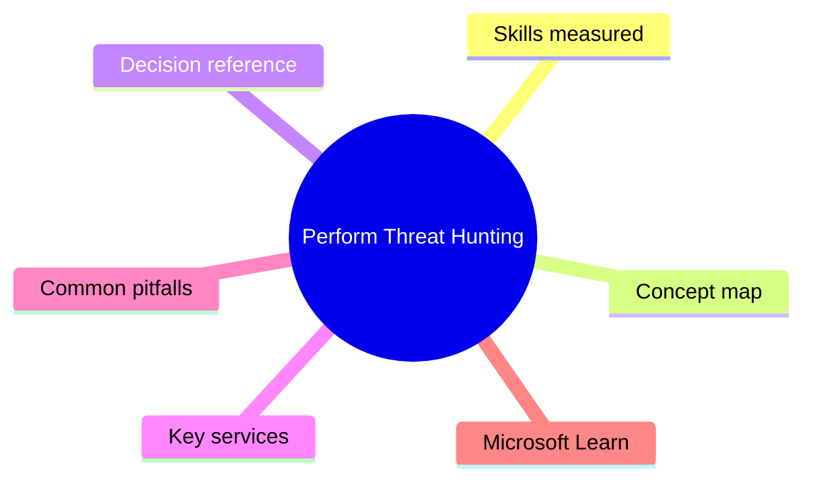
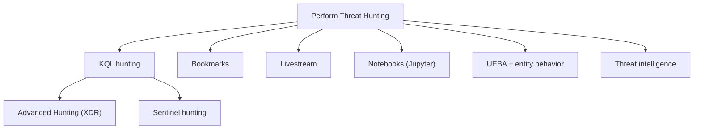

# Perform Threat Hunting

> Domain 4 of SC-200. Weight: 20%.

## Domain mind map

## Skills measured

- Hunt in Microsoft Defender XDR using KQL on advanced hunting tables
- Hunt in Microsoft Sentinel using KQL across connected sources
- Use bookmarks, livestream, and notebooks (Jupyter) for ongoing hunts
- Manage threat indicators and integrate threat intelligence feeds
- Use UEBA insights and entity behavior pages

## Concept map

## Decision reference

| When you see... | Pick... | Why |
|---|---|---|
| Long-running ongoing query | Sentinel livestream | Real-time results |
| Pivot through related users/files | Sentinel bookmark + investigate graph | Saves context |
| Need ML / data science on incident | Sentinel notebooks (Jupyter) with MSTICpy | Power tools |
| Find rare process across 90 days | Advanced hunting in DfE (DeviceProcessEvents) with summarize/take 10 | Cross-host visibility |
| UEBA-based anomaly | Sentinel UEBA solution | Per-user/peer baseline |

## Key services

- **Advanced Hunting (Defender XDR)** - KQL across DeviceX / Email / Identity / CloudApp tables
- **Sentinel Hunting** - Hunting queries + livestream + bookmarks + notebooks
- **Threat intelligence (TI)** - STIX/TAXII feeds + custom indicators + MS TI feed
- **UEBA solution** - User and entity behavior analytics

## Common pitfalls

- Running unbounded KQL (no time filter) and timing out + costing money
- Forgetting Advanced Hunting has table-name differences across Defender workloads
- Storing IOCs without expiry leading to alert fatigue
- Hunting only known TTPs - leave room for hypothesis-driven hunts

## Microsoft Learn

- [Threat hunting in Microsoft Sentinel](https://learn.microsoft.com/training/paths/sc-200-perform-threat-hunting-microsoft-sentinel/)
- [KQL learn path](https://learn.microsoft.com/training/paths/kusto/)

---

[<- Manage Incident Response](03-incident-response.md) | [Master Index](00-MASTER-INDEX.md) | [Cheatsheet ->](05-exam-cheatsheet.md)
