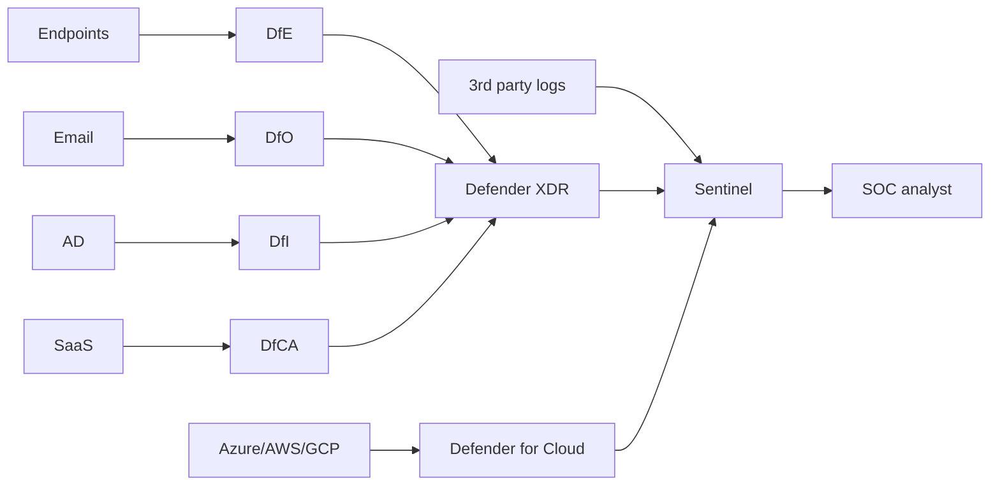
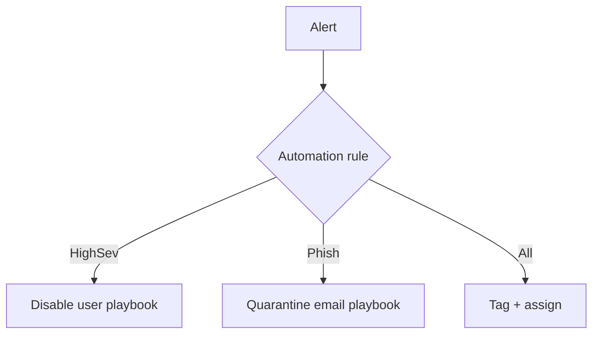

# Architectures - SC-200

> Reference architectures you should be able to draw on a whiteboard for the exam.

## Unified SecOps

```mermaid
flowchart LR
    EP[Endpoints] --> DfE
    Email --> DfO
    AD --> DfI
    SaaS --> DfCA
    DfE --> XDR[Defender XDR]
    DfO --> XDR
    DfI --> XDR
    DfCA --> XDR
    Cloud[Azure/AWS/GCP] --> DfC[Defender for Cloud]
    Third[3rd party logs] --> Sentinel
    XDR --> Sentinel
    DfC --> Sentinel
    Sentinel --> SOC[SOC analyst]
```

## Auto-response flow

```mermaid
flowchart TD
    A[Alert] --> R{Automation rule}
    R -->|HighSev| PB1[Disable user playbook]
    R -->|Phish| PB2[Quarantine email playbook]
    R -->|All| Tag[Tag + assign]
```

---

[Master Index](00-MASTER-INDEX.md)
